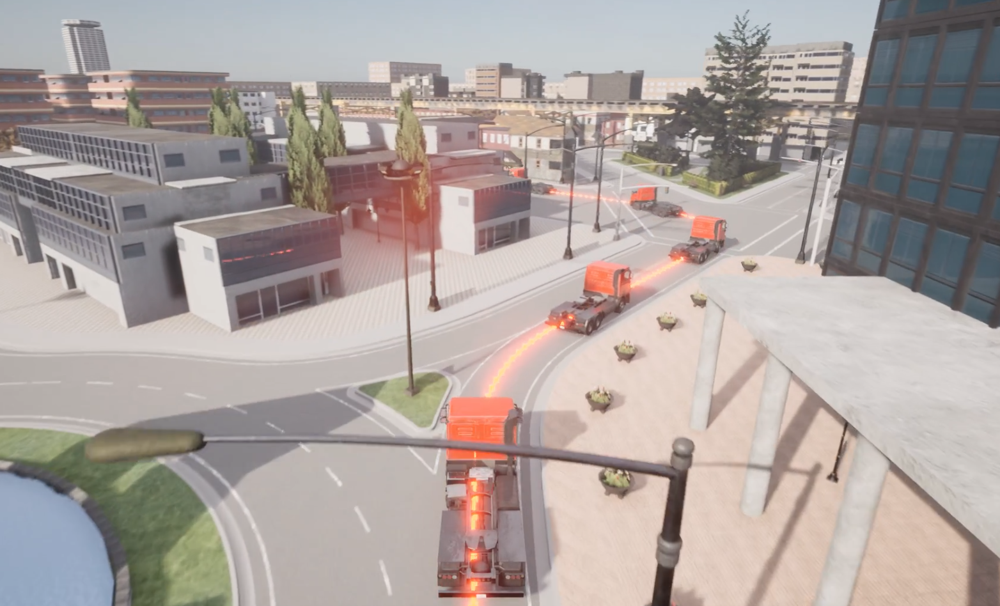

# Modeling and Control Approach for Platooning with Safety Guarantees

First, you should build the project, you can build the project offline or pull the image online:

## build the project

```bash
# in the workspace, set the environment variable
chmod +x dev_config.sh
./dev_config.sh

# build the project offline, option 1
docker compose build
# pull the environement online, option 2
docker compose pull
```

Use control + c to quit the environment.

## run the projectd

```bash
docker compose up -d
```

## Notes

In the docker carla-ros2-bridge, we can specify the host number using "host='carla_server'"

```bash
ros2 launch carla_ros_bridge carla_ros_bridge.launch.py host:='carla_server'
```

if you want to see the example, you can use this(you can change it in the docker file):

```bash
ros2 launch carla_ros_bridge carla_ros_bridge_with_example_ego_vehicle.launch.py host:='carla_server'
```
### Recorded Video  
[](https://streamable.com/ogo7me)

### Visulization

to visualize the project we can use carlaviz

```bash
docker pull mjxu96/carlaviz:0.9.13
docker run -it --network="host" mjxu96/carlaviz:0.9.13 \
  --simulator_host localhost \
  --simulator_port 2000
```
